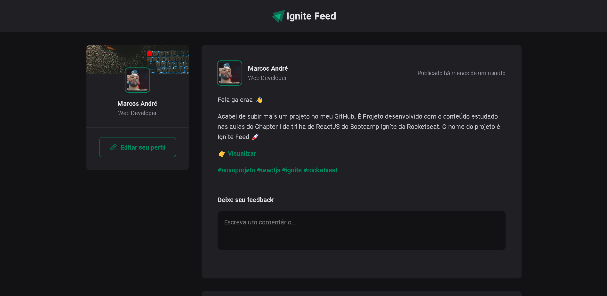
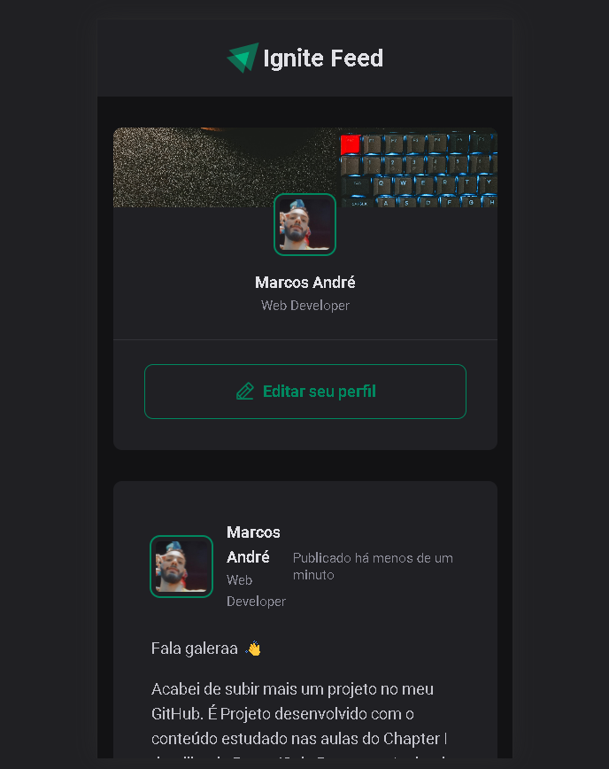

# Ignite Feed

<div align="center">
	
  
</div>

## :dart: Objetivo

Projeto que simula o feed de uma rede social, com funcionalidades de comentários, likes e apagar comentário. Projeto
desenvolvido com o conteúdo estudado nas aulas do Chapter I da trilha de ReactJS do Bootcamp Ignite da Rocketseat

## :hammer_and_wrench: Ferramentas

- [@phosphor-icons/react](https://github.com/phosphor-icons/react)
- [date-fns](https://www.npmjs.com/package/date-fns)
- [react-hook-form](https://react-hook-form.com/)
- [react](https://pt-br.reactjs.org/)
- [yup](https://www.npmjs.com/package/yup)
- [typescript](https://www.typescriptlang.org/)

## :desktop_computer: Padronização de código

- [Eslint](https://eslint.org/)
- [Prettier](https://prettier.io/)
- [EditorConfig](https://editorconfig.org/)

## :rocket: Executando o projeto

```bash
// Instale as dependências

yarn install

// Concluindo a instalação rode

yarn dev
```
